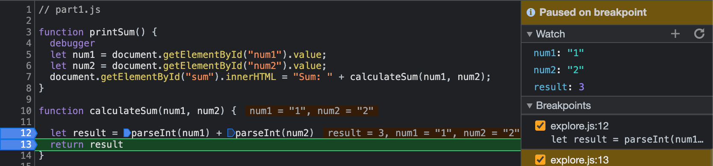

1. The bug was that the inputs `num1` and `num2` were of string data type, which caused `result` to be of string data type. Since `num1` and `num2` were of string data types, adding them together caused concatenation instead of actual arithmetic adding.

2. To fix it, we could convert `num1` and `num2` to integers using the `parseInt` function before the adding occurs, that way the actual arithmetic is performed.

